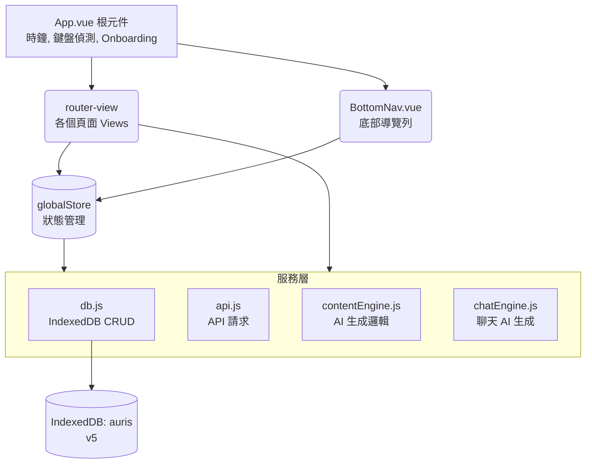

# Auris — 架構規格說明

> 維護這份文件的原則：每次新增頁面、服務、或重要設計決策時一起更新。  
> 最後更新：2026-06-12（P76）

---

## 目錄

1. [整體架構](#1-整體架構)
2. [資料流向](#2-資料流向)
3. [IndexedDB 資料庫](#3-indexeddb-資料庫)
4. [Services 服務層](#4-services-服務層)
5. [Store 全局狀態](#5-store-全局狀態)
6. [Router 路由](#6-router-路由)
7. [Views 頁面](#7-views-頁面)
8. [Components 元件與 UI 系統](#8-components-元件與-ui-系統)
9. [CSS 樣式系統](#9-css-樣式系統)
10. [維護注意事項](#10-維護注意事項)
11. [新增頁面標準流程](#11-新增頁面標準流程)
12. [版本更新紀錄](#12-版本更新紀錄)

---

## 1. 整體架構



---

## 2. 資料流向

### 頁面讀取資料
1. View `onMounted` 階段
2. 呼叫 `globalStore.loadCharacters()` 更新全局角色列表
3. 呼叫 `dbAll('xxx')` 或 `dbIdx('xxx', ...)` 讀取頁面所需的資料
4. 渲染至畫面

### 使用者操作寫入資料
1. 使用者觸發動作 (e.g. 點擊按鈕)
2. View 方法呼叫 `dbPut('xxx', data)` 寫入 IndexedDB
3. (若角色變動) 呼叫 `globalStore.loadCharacters()`
4. 更新 local ref 以立即反映 UI 變更

### AI 生成流程
1. 使用者點擊「生成」或傳送訊息
2. View 呼叫 `contentEngine` 或 `chatEngine` 相關生成函式
3. 服務層讀取 `getSetting` 取得 API 參數與金鑰
4. 讀取所需角色資料 (`dbGet`) 並組合 Prompt
5. 透過 `fetchWithTimeout` 呼叫外部 API (OpenAI/Anthropic/Google)
6. 解析回應後，透過 `dbPut` 存入 DB
7. 回傳結果，View 將新資料推入畫面列表 (無須重新讀取 DB)

---

## 3. IndexedDB 資料庫

**資料庫名稱**：`auris`　**版本**：v5

| 資料表 | keyPath | 索引 | 說明 |
|--------|---------|------|------|
| `characters` | `id` | `worldId` | 角色完整設定（軟欄位：作息 `workTime`/`workPlace`/`restTime` P62、`scheduleTriggers` 時段 P66、`autoSummarize`/`autoSumEvery`/`lastAutoSumAt` P62） |
| `messages` | `id` | `charId`, `createdAt` | 單人聊天訊息（軟欄位：`image` 圖片 base64 P65、`reaction` 表情 P62） |
| `memories` | `id` | `charId` | Heart Voice 心聲記錄 |
| `moments` | `id` | `charId`, `createdAt` | 貼文（含 likes/comments） |
| `diary` | `id` | `charId`, `date` | 日記（`date` 格式：YYYY-MM-DD） |
| `dreams` | `id` | `charId` | 夢境 |
| `worlds` | `id` | — | 世界書詞條庫（P65）；多世界系統 `worldId` 索引預留 |
| `groups` | `id` | — | 群組設定 |
| `group_messages` | `id` | `groupId`, `createdAt` | 群組訊息 |
| `notifications` | `id` | `charId`, `createdAt` | 通知記錄 |
| `chat_memories` | `id` | `charId` | 長期記憶條目（P48）|
| `settings` | `key` | — | 系統設定（key-value） |

### Settings 常用 key

| key | 說明 |
|-----|------|
| `api_key` | API 金鑰 |
| `api_provider` | `'openai'` / `'anthropic'` / `'google'` / `'vertex'` / `'openrouter'` |
| `api_model` | 模型名稱字串 |
| `api_base` | 自訂 API 位址（空 = 用預設） |
| `theme` | 主題名稱（`cream` / `warm` / `dark` / `gray` / `ocean` / `matcha`） |
| `me_settings` | 使用者自身設定物件（名字、年齡、個性等）；玩家頭像 `avatar`（emoji 或圖片 base64，P62）；生理期欄位 `cycleEnabled` / `lastPeriodStart` / `cycleLength` / `periodLength`（P59，全本地）；玩家作息欄位 `workTime` / `workPlace` / `restTime`（P63） |
| `onboarding_done` | `true` = 已完成新手引導 |
| `last_auto_gen_date` | 最後一次自動生成日期（`YYYY-MM-DD`），防重複觸發 |
| `last_seen_announcement` | 最後看過的更新公告版本（P53），用於決定是否彈出公告 |
| `cycle_care_<charId>` | 各角色最後一次生理期主動關心的日期（P59），per-char 去重 |

> [!WARNING]
> **升版注意**：升版（`version` 數字 +1）只能「新增」資料表或索引，不能修改已有結構。修改已有 store 的結構必須刪掉重建，**會清空該 store 的資料**。

---

## 4. Services 服務層

### `services/db.js`
IndexedDB 的所有讀寫操作都走這裡，絕對不要在 View 裡直接操作原生 `indexedDB`。

| 函式 | 用途 |
|------|------|
| `initDB()` | 開啟/升版資料庫，`main.js` 啟動時呼叫 |
| `dbPut(store, value)` | 新增或更新一筆（keyPath = `id` 或 `key`） |
| `dbGet(store, key)` | 讀取單筆 |
| `dbAll(store)` | 讀取全部 |
| `dbIdx(store, indexName, value)` | 用索引查詢多筆 |
| `dbDel(store, key)` | 刪除單筆 |
| `getSetting(key)` | 讀取 settings |
| `setSetting(key, value)` | 寫入 settings |

### `services/api.js`
API 請求的底層工具。

| 函式 | 用途 |
|------|------|
| `fetchWithTimeout(url, opts, ms)` | 帶逾時設定的 fetch，abort 後拋 `'request_timeout'` |
| `sendLLMRequest(messages, config)` | 統一的 LLM 呼叫入口，自動處理 API 格式差異 |

> [!NOTE]
> **Gemini 相容性**：Gemini 不支援 `frequency_penalty` / `presence_penalty`，`sendLLMRequest` 已內部處理。

### `services/format.js`
共用文字處理。`formatContent(str)`：escape `&`/`<`/`>` 後將 `\n` 轉 `<br>`，並清洗夾在中文字／標點之間的孤立換行（P56）。全站六個 v-html 渲染點統一引用，避免某處漏 escape 形成 stored XSS（P55 抽出）。

### `services/cycle.js`（P59）
生理期週期計算，全本地、不上傳。

| 函式 | 用途 |
|------|------|
| `getCyclePhase(me)` | 依 `lastPeriodStart` + `cycleLength`(預設28) + `periodLength`(預設5) 推算今天落在 `period`/`pms`/`ovulation`/`normal`，回傳含 `dayNum`/`daysUntilNext` |
| `cycleCareContext(phase)` | 依階段組裝注入 system prompt 的關心 context（僅 period/pms 有內容） |
| `cyclePhaseLabel(phase)` | UI 預覽用的階段中文標籤 |

### `services/contentEngine.js` 與 `chatEngine.js`
AI 內容與對話生成邏輯：

- `contentEngine.js`：負責生成貼文 (`generatePost`)、日記 (`generateDiary`)、夢境 (`generateDream`) 以及留言回覆 (`generateCommentReply`)。每次生成成功後會同步寫入 `notifications` store，讓通知頁顯示新動態。**P56 起**：`generatePost` 與 `generateDream` 在 prompt 中加入最近 6–8 則聊天紀錄 context；**P60**：三處重複的近期對話組裝提取為 `buildRecentChat()` 工具函式。
- `chatEngine.js`：核心對話引擎，主要函式：
  - `generateAIResponseStream` — 一對一串流回覆，完成後觸發 Heart Voice
  - `generateGroupAIResponseStream` — 群組串流回覆，支援 `onStart`（切換動畫）與 `onChunk`（逐字更新）
  - `generateProactiveMessageStream` — 主動訊息串流，配合背景計時器使用；**P56 起**：主動訊息落地後會寫入 `notifications`（`type: 'chat'`），通知中心可查
  - `summarizeToMemory` — 將近期對話濃縮為 `chat_memories` 條目；**P62 起**：可由 `ChatRoomView.maybeAutoSummarize()` 在達 `autoSumEvery` 門檻時背景自動觸發
  - `generateHeartVoice` — 機率性生成說不出口的心聲，寫入 `memories` 並發出 `new-heart-voice` 事件與通知
  - `generateCycleCareMessage` — 生理期主動關心（P59），非串流生成關心訊息 → 存 assistant 訊息 + `unreadCount++` + `type:'chat'` 通知
  - `generateScheduleMessage` — 作息時段主動訊息（P66），由 `App.vue` 每 5 分鐘掃 `scheduleTriggers`，命中時段且當天未發過才觸發
  - **世界書注入**（P65）：`buildAIChatSetup` 掃描近 10 則訊息，命中詞條名稱／別名才把對應 `worlds` 詞條注入 system prompt（`worldCtx`），不觸發不佔 token
  - **圖片識別**（P65）：`sendUserMessage` 加 `image` 參數、`generateAIResponseStream` 加 `imageBase64`，`buildImgHistory()` 依 provider 轉成 Anthropic／OpenAI／Vertex 各自的圖片 content 格式
  - **角色作息注入**（P62）：`buildAIChatSetup` 組 `scheduleCtx`（角色 `workTime`/`workPlace`/`restTime`，接在 `timeCtx` 後），請角色依現在時間推測自身狀態；與 P63 的玩家作息 `playerScheduleCtx` 互補
  - **生理期被動體貼**（P59）：`buildAIChatSetup` 在角色 `cycleCare` 開啟且階段為 period/pms 時，將 `cycleCareContext()` 注入 system prompt（其餘階段為空字串）
  - **玩家作息注入**（P63）：`buildAIChatSetup` 新增 `playerScheduleCtx`，讀 `me_settings.workTime`/`workPlace`/`restTime`，告知角色對方當前可能狀態（上班中／休息中），讓主動訊息語氣符合情境
  - **時間間隔 Bug 修正**（P67）：`buildAIChatSetup` 計算「距上次對話間隔」時，`allMsgs` 末位是剛送出的使用者訊息（時間差近 0），改用 `allMsgs[length-2]` 作為比較基準，正確偵測跨天間隔並注入時間流逝提示。
  - **API Error Handling**：支援 Array 格式 Proxy 錯誤捕捉；群組放寬 `max_tokens: 4000`；生成錯誤時以「【系統偵錯】」訊息顯示於畫面；**P60**：串流回應為空時改顯示明確 toast，不再靜默消失。
  - **群組玩家名字**：`buildGroupChatSetup` 使用 `getSetting('me_settings')` 讀取玩家資料（P56 修正 key 錯誤）；model fallback 用 `getDefModel(provider)`（P60 修正寫死 bug）。

---

## 5. Store 全局狀態

**檔案**：`store/index.js`  
使用 Vue 3 `reactive()` 實作，不依賴 Pinia 以保持輕量。

```javascript
globalStore = {
  theme: 'cream',          // 當前主題，綁到 App.vue data-theme
  characters: [],          // 所有角色陣列，各頁面共用
  keyboardOffset: 0,       // 鍵盤高度（px），用於 BottomNav 隱藏判斷

  init()             // App.vue onMounted 呼叫
  loadCharacters()   // 重新從 DB 載入 characters（各 View onMounted 呼叫）
}
```

---

## 6. Router 路由

**檔案**：`router/index.js`  
使用 `createWebHistory`（需配合 GitHub Pages 的 404 重導機制）。

| 路由 | name | BottomNav 顯示 |
|------|------|---------------|
| `/` | `home` | ✅ |
| `/chat-list` | `chat-list` | ✅ (對話 tab) |
| `/chat/:id?` | `chat` | ❌ 隱藏 |
| `/moments` | `moments` | ✅ (貼文 tab) |
| `/post/:id` | `post-detail` | ❌ 隱藏 |
| `/diary` | `diary` | ✅ |
| `/diary/:id` | `diary-detail` | ❌ 隱藏 |
| `/dream` | `dream` | ✅ |
| `/dream/:id` | `dream-detail` | ❌ 隱藏 |
| `/group-list` | `group-list` | ✅ (對話 tab) |
| `/group-room/:id?` | `group-room` | ❌ 隱藏 |
| `/group-create` | `group-create` | ❌ 隱藏 |
| `/blackbox` | `blackbox` | ✅ |
| `/notifications` | `notifications` | ✅ |
| `/me` | `me` | ✅ (我的 tab) |
| `/settings` | `settings` | ✅ (我的 tab) |
| `/api` | `api` | ❌ 隱藏 |
| `/lock` | `lock` | ❌ 隱藏 |
| `/onboarding` | `onboarding` | ❌ 隱藏 |
| `/char-manage` | `char-manage` | ❌ 隱藏 |
| `/char-edit/:id?` | `char-edit` | ❌ 隱藏 |
| `/worlds` | `worlds` | ❌ 隱藏（設定頁進入，P65） |
| `/worlds/edit/:id?` | `worlds-edit` | ❌ 隱藏（P65） |

> 共 23 條路由。

---

## 7. Views 頁面

### 頁面標準結構

每個 View 的 `<template>` 都應遵循此架構：

```html
<div class="page active" id="pg-xxx">
  <!-- 頁首 -->
  <div class="ph">
    <div class="ph-back" @click="$router.push('...')">返回</div>
    <div class="ph-title">標題</div>
    <div class="ph-act">右側動作</div>
  </div>

  <!-- 主要內容區 -->
  ...
</div>
```

### 關鍵 View 說明

- **ChatRoomView (單人聊天)**：串流逐字輸出（`generateAIResponseStream`）、長按訊息選單（複製／編輯重傳／重新生成）、記憶抽屜（AI 總結、手動新增、編輯、toggle、刪除）、背景主動訊息計時器（`scheduleProactive`）、auto-interrupt 打斷模式。**P62 起**：玩家訊息帶自訂頭像列、長按可加表情反應（`reaction`）、達門檻自動總結（`maybeAutoSummarize()`）。**P65 起**：相機按鈕傳圖（`compressImage()` 壓 512px）、泡泡圖片渲染與 `viewImage()` 全螢幕預覽。**P67 起**：訊息列表在跨日邊界自動插入「M 月 D 日　星期X」分隔標籤（`showDateSep()` / `fmtDateSep()`）。**P76 起**：⋯ 選單重組——加「他的日記」「他的夢境」捷徑（`?char=` 跳轉預選）；清除/匯出/匯入收進「聊天記錄管理」二層選單（`showDataMenu`）。
- **GroupRoomView (群組聊天)**：多角色串流輪替回覆，`@點名` 強制指定角色，角色前綴清洗防止 AI 混淆發言。
- **CharEditView (角色編輯)**：5 個 Tab 切換，包含基本資訊、個性背景、說話方式、關係規範、AI 參數，必須確保 modal CSS 存在以正常顯示彈窗。自動功能區含「生理期關心」toggle（`char.cycleCare`，預設 false，P59）。
- **MeView (我的設定)**：玩家自身資料；含「作息 / 行程」區塊（`workTime`/`workPlace`/`restTime`，P63）與「生理期追蹤」區塊（主開關、最近經期開始日、週期長度、經期天數，即時預覽推算階段，P59），資料寫入 `me_settings`。儲存成功後 toast 提示再導頁（P64）。
- **HomeView**：快速入口磚牆（對話、貼文、夢境、黑盒子、通知等），角色橫向捲動快選。**P55 起**：通知 tile 動態讀取 `notifications` store 未讀數，有未讀時顯示玫瑰色 badge 與「X 則未讀」文字。**P75 起**：Widget 化——最近對話卡片（每角色最後一句、未讀、相對時間，點列直入聊天室）、每日一問卡片（當日未回答才顯示）、心聲/日記/夢境/通知活磁磚（最新內容節錄＋計數）、角色列依最後對話時間排序、貼文/群組/世界書降為「更多」捷徑列。
- **MomentsView / PostDetailView**：貼文列表與留言回覆。
- **DiaryView / DiaryDetailView**：日記列表與全文展示。**P76 起**：支援 `?char=` query 預選角色篩選（聊天室「他的日記」入口）。
- **DreamView / DreamDetailView**：夢境列表與全文展示。**P76 起**：新增角色篩選 chips（沿用 `.diary-chip` 樣式）與 `filteredDreams`；支援 `?char=` query 預選篩選與生成對象。
- **BlackboxView**：Heart Voice 心聲記錄。
- **NotificationsView**：顯示貼文／日記／夢境／心聲／主動訊息生成後寫入的通知，點擊跳轉對應頁面。支援 `type`：`post` / `diary` / `dream` / `hv` / `chat`。
- **WorldsView / WorldEditView (世界書，P65)**：與角色脫鉤的全域詞條庫（`worlds` store）。列表頁支援分類篩選與啟用 toggle；編輯頁設定名稱（觸發關鍵字）、別名、分類、內容、適用角色。對話時由 `buildAIChatSetup` 命中關鍵字才注入 prompt。

---

## 8. Components 元件與 UI 系統

### `BottomNav.vue`
- 使用 `useRoute()` 判斷當前路由。
- `.kb-hidden`：鍵盤拉起時隱藏整個導覽列，優化手機打字體驗。

### Toast 系統
- 取代原生 `window.alert()` 的全域通知系統。
- 在 `App.vue` 實作，掛載於 `<div id="toast" class="toast">`。
- 任何地方（View 或 Service）統一用 `window.toast_('訊息')` 呼叫。
- 可選第二參數毫秒數控制顯示時間（預設 4500ms）。

---

## 9. CSS 樣式系統

**主檔**：`assets/main.css`（集中管理所有樣式）

### 主題系統
透過 `[data-theme="xxx"]` 切換 CSS 變數：
```css
[data-theme="cream"] { --bg: #faf8f5; --rose: #c9826a; }
[data-theme="dark"]  { --bg: #1a1a1a; --rose: #e8907a; }
```

### 常用基礎 Class
| Class | 說明 |
|-------|------|
| `.page` | 頁面根容器，設定為滿版及垂直捲動 |
| `.ph` | 頁首 (Page Header) |
| `.empty-cta` | **空狀態的行動按鈕（玫瑰色背景，專屬）** |
| `.btn-primary` | 深色主要按鈕（如聊天發送） |
| `.modal-overlay` / `.modal-box` | 彈窗遮罩與底部升起內容區 |

---

## 10. 維護注意事項

1. **刪除關聯資料**：在刪除角色時，必須同步清除所有帶有該 `charId` 的資料表：`messages`, `memories`, `chat_memories`, `moments`, `diary`, `dreams`, `notifications`。
2. **新增設定項目**：直接透過 `setSetting('new_key', value)` 新增即可，不需修改資料庫結構。
3. **空狀態原則**：遇到尚未開發或空列表時，按鈕一律使用 `.empty-cta` 而非 `.btn-primary`，且未完成的功能應掛上 `@click="$toast('尚在開發，敬請期待')"`。

---

## 11. 新增頁面標準流程

1. 建立檔案：`src/views/XxxView.vue`。
2. 註冊路由：在 `router/index.js` 新增路由物件。
3. 控制導覽列：若需隱藏 BottomNav，將路由名稱加入 `App.vue` 的 `hiddenRoutes` 陣列。
4. 設定高光：在 `BottomNav.vue` 中將路由加入對應的 active 判斷邏輯。

---

## 12. 版本更新紀錄

### P76（2026-06-12）操作簡化：聊天室捷徑・選單二層化・夢境篩選

- **聊天室 ⋯ 選單重組**（`ChatRoomView.vue`）：新增「他的日記」「他的夢境」（`goDiary()` / `goDream()`，以 `?char=charId` 跳轉）；「清除/匯出/匯入聊天記錄」收進「聊天記錄管理 ›」二層 bottom-menu（`showDataMenu`），清除項紅色標示；主選單剩 5 項高頻操作。
- **`?char=` 預選**：`DiaryView.vue` / `DreamView.vue` 的 `onMounted` 讀 `route.query.char`（驗證角色存在）預選篩選 chip；DreamView 同步預選生成對象 `selectedCharId`。
- **夢境角色篩選列**（`DreamView.vue`）：沿用 `.diary-filter` / `.diary-chip` 全域樣式，新增 `filterCharId` / `filteredDreams`；篩選後無結果顯示「這個角色還沒有夢境」。
- **多世界模式標示**（`SettingsView.vue`）：「主世界」字樣＋chevron 改為玫瑰色「即將推出」pill，移除死路感（點擊 toast 保留）。

---

### P75（2026-06-12）首頁 Widget 化

- **設計理念**：首頁維持「手機桌面」隱喻但內容變活（iOS widget 概念）——磁磚保留，顯示「他們正在發生什麼」。
- **最近對話 widget**（`HomeView.vue`）：onMounted 以 `dbIdx('messages','charId')` 掃每角色訊息（排除 `type:'hv'`），取最後一句組成最近 3 筆對話列（頭像/名字/節錄/相對時間/未讀點），點列進聊天室；區段標題加「全部 ›」。
- **每日一問 widget**：偵測當日 id 結尾 `_dq` 且其後無 user 訊息的提問，顯示問題卡片連到該聊天室；回答後自動隱藏。
- **角色生活活磁磚**：心聲（`memories` 最新）、日記（`diary` 最新＋計數）、夢境（`dreams` 最新＋計數）、通知（未讀最新＋badge）皆動態載入，各有空狀態。
- **角色列**：依最後對話時間排序，「新增角色」移至列尾。問候語改依時段 computed。
- **CSS**（`main.css`）：新增「首頁 Widget（P75）」區（`.wg` / `.wc-*` / `.wq-*` / `.t-hd` / `.t-live` / `.t-meta` / `.sc-row` / `.sc` / `.h-sec-row` / `.h-sec-more`）；深色主題 avatar 修正納入 `.wc-av`；≤374px 響應調整。

---

### P72（2026-06-06）角色設定重整・自訂紀念日・MeView 分組・關係主頁多入口

- **CharEditView Tab 重整**：Tab 3「關係與規範」→「關係設定」；Tab 4「回覆設定」→「進階設定」。行為規範（isAI、taboo、extra）從 Tab 3 移至 Tab 4。scheduleTriggers 從 Tab 1 移至 Tab 4。
- **關係主頁快捷入口**（`CharEditView.vue` Tab 3 頂部）：isEdit 模式下顯示「查看關係主頁 →」連結；`CharManageView.vue` 角色卡新增「關係」按鈕。
- **自訂紀念日**（`CharEditView.vue`）：Tab 3 新增 `anniversaries` 動態陣列（label + date），取代硬編碼 meetDate UI；onMounted 自動遷移舊 meetDate 資料至 anniversaries。`RelationView.vue` 的 upcoming computed 同步顯示自訂紀念日。
- **MeView 分組重構**（`MeView.vue`）：從單一長表單改為「基本資訊 / 個性描述 / 生日 / 作息 / 生理期追蹤」五個語意分組；persona/note 標籤釐清為長期 vs. 彈性；cycleCare 提示更新指向「進階設定 Tab」。
- **HomeView**：公告按鈕版號更新至 P72。

---

### P71（2026-06-06）導航重構

- **全域 router.back()**：所有頁面返回按鈕從硬編碼路由改為 `$router.back()`，確保「從哪來回哪去」的正確行為（20+ 個 view）。
- **儲存留原頁**：`CharEditView`、`MeView`、`WorldEditView` 儲存後不跳頁，顯示 toast 提示。新建項目首次儲存後以 `router.replace` 更新路由，修正 ID 重複建立與 createdAt 重複寫入的 bug。
- **首頁清理**：移除首頁「設定」區塊（我的設定＋系統設定磚塊，底部導航已提供）。首頁「新增角色」直連 `/char-edit`。
- **設定頁重整**（`SettingsView.vue`）：頂部改為個人資訊卡（頭像＋名字，點擊進入我的設定）；角色管理改為多人圖示；移除清單中的我的設定列。
- **BottomNav 優化**（`BottomNav.vue`）：`我的` 標籤改為`設定`；設定 tab 高亮範圍擴大至 `me`、`worlds`、`worlds-edit` 路由。

---

### P69（2026-06-06）生日紀念日系統 + 關係主頁

- **生日/紀念日欄位**（`CharEditView.vue`）：Tab3 新增「紀念日」區段：角色生日（`birthday`）、相識日（`meetDate`）、在一起日（`togetherDate`）—— date picker 軟欄位，無需 DB 升版。
- **玩家生日**（`MeView.vue`）：`me_settings` 加 `birthday` 欄位，`me` reactive 預設值同步補上。
- **個人日期感知**（`chatEngine.js`）：新增 `getPersonalDateCtx(char, me)`，比對今日 MM-DD，若命中生日/紀念日則注入 `【紀念日】` 段落至 system prompt（與 timeAware 無關，獨立觸發）。
- **RelationView**（新建 `views/RelationView.vue`）：路由 `/relation/:id`，聊天室選單「關係主頁」進入；顯示在一起天數（主視覺）、相識天數、對話則數、90 天內重要日子倒數。
- **路由 + 導覽**（`router/index.js`、`App.vue`、`ChatRoomView.vue`）：新增路由，`relation` 加入 `hiddenRoutes`，聊天選單加入口與 `goRelation()`。

---

### P68（2026-06-06）節日季節感知 + 首頁動態磚塊 + 自訂 confirm modal + 語音輸入

- **節日/季節感知**（`chatEngine.js`）：新增 `getHolidaySeasonCtx()`，依當天日期計算季節（春/夏/秋/冬）與節日（固定西方節日 + 農曆節日硬編碼 2025–2027），在 `timeAware` 開啟時一併注入 timeCtx（格式：`，夏天，今天是端午節`）。
- **首頁磚塊動態化**（`HomeView.vue`）：日記／夢境磚塊副標題改為 `onMounted` 查詢 IndexedDB，顯示今日已生成數量或「今日未生成」/「點擊生成」。
- **全域 confirm modal**（`App.vue`）：新增 `window.confirm_()` Promise API（Teleport 彈出層），取代原生 `confirm()` 的 4 處呼叫（GroupListView、CharEditView、ChatListView、SettingsView）。
- **語音輸入**（`ChatRoomView.vue`）：輸入列新增麥克風按鈕，使用 `SpeechRecognition` API（`lang: zh-TW`），辨識結果附加至 `inputContent`；錄音中以玫瑰色脈衝動畫提示；不支援時顯示 toast。

---

### P67（2026-06-05）時間感知 Bug 修正 + 聊天日期分隔線 + 卡片間距修正

- **時間感知 Bug**（`chatEngine.js` `buildAIChatSetup`）：`lastMsg` 改取 `allMsgs[length-2]`，修正跨天/長時間間隔無法觸發時間流逝提示的問題（根因：`allMsgs` 末位是剛送出的使用者訊息，`Date.now() - lastMsg.createdAt` 幾乎為 0）。
- **聊天日期分隔線**（`ChatRoomView.vue`）：新增 `showDateSep(i)` / `fmtDateSep(ts)` 函式，在訊息列表相鄰訊息跨日時自動插入「M 月 D 日　星期X」分隔標籤；新增 `.chat-date-sep` scoped CSS。
- **日記／夢境卡片間距**（`DiaryView.vue`、`DreamView.vue`）：`<div v-else>` wrapper 補 `display:flex;flex-direction:column;gap:12px/10px`，修正 `.diary-list` / `.dream-list` 的 `gap` 因多一層 wrapper 而無法套用至卡片之間的問題。

---

### P66（2026-06-03）Bug 修正 + 作息主動訊息 + 時間流逝感知

- **貼文留言頭像**（`PostDetailView.vue`）：`cm.role === 'user'` 的頭像改從 `me_settings.avatar` 讀取，支援 emoji 與 base64 圖片。
- **角色冠夫姓修正**（`chatEngine.js`）：`c.call` 加「不可擅自改稱謂」；`youName` 加「不可幫對方冠夫姓或改名」。
- **時間流逝感知**（`chatEngine.js` `buildAIChatSetup`）：`timeAware` 開啟時，若距最後一則訊息 ≥ 3 小時，自動在 system prompt 注入時間差提示（`gapHrs`、前後時間戳）。
- **作息主動訊息**（`CharEditView.vue` + `chatEngine.js` + `App.vue`）：
  - `characters.scheduleTriggers`：新軟欄位，陣列，每筆 `{ time: 'HH:MM', desc: string, enabled: bool }`。
  - `generateScheduleMessage(charId, triggerDesc)`：非串流背景生成，結構同 `generateCycleCareMessage`。
  - `runScheduleTriggers()`：`App.vue` 每 5 分鐘執行，以 `±4 分鐘容差`命中時段；`sched_sent_{charId}_{time}_{date}` key 去重，同一時段一天只發一次。

---

### P65（2026-06-02）世界書 + 圖片傳送

**世界書（World Book）**
- 新增 `views/WorldsView.vue`：詞條列表，分類篩選（地點/人物/規則/物件/歷史），啟用 toggle。
- 新增 `views/WorldEditView.vue`：詞條編輯，含名稱/別名/分類/內容/適用角色/啟用。存入既有 `worlds` store（DB v5 已預留）。
- `router/index.js`：新增 `/worlds`、`/worlds/edit/:id?` 兩條路由，共 23 條。
- `services/chatEngine.js` `buildAIChatSetup`：新增 `worldCtx`，掃描近 10 則對話命中詞條名稱或別名才注入，節省 token。
- `views/SettingsView.vue`：世界書入口從 toast 改為實際路由跳轉。

**圖片傳送與 AI 識別**
- `services/chatEngine.js` `sendUserMessage`：加 `image` 選用參數，存入 `messages.image`（軟欄位，免升版本）。
- `services/chatEngine.js` `generateAIResponseStream`：加 `imageBase64` 選用參數，新增 `buildImgHistory(provider)` 將最後一則 user 訊息改為多模態格式：Anthropic 用 `image+text` content block；OpenAI 相容用 `image_url+text` array；Vertex 用 `inlineData+text` parts。
- `views/ChatRoomView.vue`：新增 camera 按鈕、隱藏 file input、`compressImage()`（canvas，512px JPEG Q0.8）、圖片預覽列（可取消）、泡泡圖片渲染（`.msg-image`）、點圖全螢幕預覽 overlay（`viewImage()`）。
- 匯出備份：圖片以 512px 壓縮版存 DB，備份含縮圖；無法對話歷史回放，但可顯示。

---

### P64（2026-06-02）UX 修正

- **返回鍵路徑**（`ChatRoomView.vue`）：`chat-hd-back` 原本導向 `/`（首頁），改為 `/chat-list`。
- **進場清除未讀**（`ChatRoomView.vue`）：`onMounted` 取得角色資料後，若 `unreadCount > 0` 或 `hasUnread` 即清零並 `dbPut` 寫回 DB，確保返回列表時未讀標示消失。
- **儲存成功提示**（`CharEditView.vue`、`MeView.vue`）：`saveChar` / `saveMe` 寫入 DB 後加 `window.toast_` 提示，再導頁至上一頁。

---

### P63（2026-06-02）玩家作息設定

- **`MeView.vue`**：新增「作息 / 行程」區，三個欄位 `workTime`（上班/上課時間）、`workPlace`（地點）、`restTime`（作息習慣），存入 `me_settings`。`me` ref 預設值同步新增三個空字串欄位。
- **`chatEngine.js` → `buildAIChatSetup`**：新增 `playerScheduleCtx`，讀取 `me.workTime`/`me.workPlace`/`me.restTime`，組裝「對方作息」context 注入 system prompt（位於角色 `scheduleCtx` 之後），讓角色感知玩家當前可能狀態並在主動訊息時體貼情境。無 IndexedDB 結構異動（`me_settings` 新增軟欄位）。

---

### P62（2026-06-02）批次更新

一版集中四項功能：

**① 自動總結記憶：**

- **觸發（`ChatRoomView`）**：玩家送訊息 `sendMsg` 與角色主動訊息流程兩處 `finally` 都背景呼叫 `maybeAutoSummarize()`。以角色 `lastAutoSumAt` 時間戳為界統計 `createdAt > lastAutoSumAt` 的非 hv 訊息數；達 `autoSumEvery`（`CharEditView` 滑桿，10～80、預設 30）時呼叫既有 `summarizeToMemory()`，存入 `chat_memories`、`unshift` 到抽屜、`dbPut` 更新 `lastAutoSumAt`。失敗只記 console；`isAutoSumming` 旗標防併發。

**② 玩家自訂大頭貼：**

- `MeView` 新增頭像區，沿用角色頭像同款上傳（FileReader → canvas 200×200 置中裁切 → base64 JPEG 0.8）與 Emoji 選擇，存 `me_settings.avatar`（預設 `🙂`）。
- `ChatRoomView` 玩家訊息改為對稱帶頭像列：`.msg-with-av.me-side`（`flex-direction:row-reverse`），連續訊息以 `.msg-av-spacer` 佔位；`onMounted` 讀 `me_settings.avatar` 存入 `meAvatar`。

**③ 角色作息設定：**

- `CharEditView` 「近況」下新增作息區：`workTime`/`workPlace`/`restTime`。
- `chatEngine.buildAIChatSetup` 組 `scheduleCtx`（接在 `timeCtx` 後）注入 system prompt，請角色依現在時間推測上班／通勤／睡覺等狀態。走共用 setup，故聊天／主動訊息／生理期關心三路徑皆生效。

**④ 訊息表情反應：**

- `ChatRoomView` action sheet 頂部加表情列（`REACTIONS`），`setReaction()` 寫入 `messages.reaction` 並 `dbPut`、點同表情/點徽章 `removeReaction()` 清除；泡泡下方以 `.msg-reaction` 徽章呈現，使用者與 AI 訊息共用。

- **資料**：無 IndexedDB 結構異動——`characters` 加軟欄位 `lastAutoSumAt`/`workTime`/`workPlace`/`restTime`，`messages` 加 `reaction`，`me_settings` 加 `avatar`，皆免升版本。

---

### P61（2026-06-02）

**連線測試強化（`ApiView.testApi`）：**

- **問題**：自訂位址打錯（`/v1` → `/v.1`）時，new-api 閘道對不存在路徑回自己的 HTML 網頁＋HTTP 200；舊 `testApi` 只檢查 `res.ok` 就報「連線成功」，但實際串流聊天在 HTML 裡找不到 `data:` → 空回應，造成「測試成功、聊天卻空」的假象。
- **修法**：新增 `looksLikeChatResponse(data)`（回應須含非空的 `choices`/`content`/`candidates` 陣列）與 `describeBadOkBody(data)`。測試改為讀回應內容驗證——`res.ok` 但非合法聊天回應（HTML／error 物件／空殼）時明確報「位址或端點不正確」，御三家＋Vertex 路徑統一套用。測試 `max_tokens` 10→16，避免 reasoning 模型回空內容誤判。

---

### P60（2026-06-01）

**代碼整理 ＋ 串流空回應錯誤提示：**

- **清理死碼**：刪除未用的 `HelloWorld.vue`；移除 `store.reloadCharacters()`（`loadCharacters()` 空殼，`CharManageView` 改直呼）；移除 `summarizeToMemory` 三個抓了沒用的變數；移除 `generateDiary` 多餘的動態 import。
- **修 model fallback**：`buildGroupChatSetup` 的 model fallback 寫死 `'gpt-5.4-mini'` → 改 `getDefModel(provider)`，避免 Anthropic 用戶選錯模型。
- **去重**：`contentEngine.js` 三處近期對話組裝提取為 `buildRecentChat()`。
- **錯誤提示**：`sendMsg` / `doRegenerate` 在串流回應為空（代理回空串流）時改顯示明確 toast，不再靜默消失。

---

### P59（2026-06-01）

**生理期關心（新檔 `services/cycle.js`）：**

- **資料**：週期設定存於 `me_settings`（`cycleEnabled / lastPeriodStart / cycleLength / periodLength`），全本地計算、不上傳。每個角色的 `char.cycleCare`（預設 false）決定該角色是否知道並關心，達成「逐角色授權」的隱私邊界。
- **`getCyclePhase(me)`**：依開始日＋週期長度＋經期天數推算 `period/pms/ovulation/normal` 及 `dayNum/daysUntilNext`。
- **被動體貼**：`buildAIChatSetup` 在 `c.cycleCare` 且階段為 period/pms 時，將 `cycleCareContext(ph)` 注入 system prompt（位置在 `timeCtx` 與 `memCtx` 之間），其餘階段為空字串。
- **主動關心**：`generateCycleCareMessage(charId, trigger)` 非串流生成關心訊息 → 存 assistant 訊息 + `unreadCount++` + `type:'chat'` 通知；由 `App.vue` `runCycleCare()` 在開 app 時於「預測經期開始日」與「經期前2天」觸發，per-char 日期 setting（`cycle_care_<id>`）去重。

---

### P58（2026-06-01）

**防誤刪角色 ＋ 清空對話範圍可選（`ChatListView.vue`）：**

- **資料模型前提**：一角色 = 一對話；`messages`、`diary`、`dreams`、`moments` 全以 `charId` 索引，綁角色而非單次對話。故「刪除對話但保留角色」在此模型下等同「清空訊息」。
- **左划移除「刪除角色」**：聊天列表左划只保留「置頂 / 清空」，不再提供殺角色入口（避免將 IM 慣例的「刪除＝刪對話串」誤解成刪角色）。刪除角色統一收斂至 `CharManageView`（已有確認 modal）。移除 `deleteChar`。
- **清空走自訂確認 modal**：以 `bottom-menu` 樣式的 modal 取代 native `confirm()`，新增 state `showClearConfirm / clearTargetIds / clearTargetName / clearAlsoContent / clearing`。`clearChat(id)` 與 `batchClear()` 統一呼叫 `openClearModal(ids, name)`，由 `confirmClear()` 執行；勾選 `clearAlsoContent` 才連帶刪 `diary/dreams/moments`，**預設僅刪 `messages/memories`**。**通知連動**：心聲（`hv`）內容實際存於 `memories`，基本清空一律會刪它，故 `hv` 通知永遠一併清除（否則點進去是死連結）；`post/diary/dream` 通知僅在勾選連帶清除時清。

---

### P57（2026-05-31）

**上線後連續修復：**

- **Anthropic CORS**（`chatEngine.js`、`api.js`）：所有 Anthropic API 呼叫加入 `anthropic-dangerous-direct-browser-access: true`，解決 CORS preflight 被擋問題。
- **IndexedDB 競態條件**（`main.js`）：`initDB()` 移至 app mount 之前 await，確保 DB 就緒後才渲染任何 View。
- **CSP vercel.live**（`index.html`）：補上 `frame-src https://vercel.live`，解決 staging 預覽 iframe 被擋問題。
- **generatePost dbIdx**（`contentEngine.js`）：補靜態 import，移除 generateDream 重複動態 import。
- **測試連線自訂模型**（`ApiView.vue`）：testApi 正確解析 `__custom__` → 實際模型 ID。
- **API 設定 UX**（`ApiView.vue`）：代理服務說明文字、友善中文錯誤訊息（401/403/404/429/逾時）。

---

### P56（2026-05-31）

**上線一週用戶反饋修復：**

- **群組聊天玩家名字 key 修正**（`chatEngine.js` → `buildGroupChatSetup`）：`dbGet('settings', 'my_profile')` 改為 `getSetting('me_settings')`，與全站其餘函式一致。
- **AI 回覆奇怪換行清洗**（`services/format.js` → `formatContent`）：加入 regex 移除夾在中文字／標點之間的孤立 `\n`，合併多餘連續換行，全站共用。
- **首頁通知 tile 動態化**（`HomeView.vue`）：動態讀取未讀通知數，有未讀時顯示玫瑰色 badge。
- **主動訊息寫入通知**（`ChatRoomView.vue` → `triggerProactive`）：主動訊息落地後寫入 `notifications`（`type: 'chat'`）。
- **貼文生成加入聊天 context**（`contentEngine.js` → `generatePost`）：加入最近 6 則聊天，讓貼文貼近近期互動。
- **夢境生成改善 context**（`contentEngine.js` → `generateDream`）：改為結構化對話格式（最近 8 則）。
- **新增 OpenRouter 服務商選項**（`ApiView.vue`、`api.js`、`chatEngine.js`）：預設 base URL `https://openrouter.ai/api/v1`，走 OpenAI 相容格式。
- **設定頁防盜與資安聲明**（`SettingsView.vue`）：版號上方新增聲明區塊。

**受影響檔案：**

| 檔案 | 變動 |
|------|------|
| `services/format.js` | 換行清洗邏輯加入共用 `formatContent` |
| `services/chatEngine.js` | `buildGroupChatSetup` key 修正；`getDefBase` 加 openrouter |
| `views/ChatRoomView.vue` | `triggerProactive` 寫通知 |
| `views/HomeView.vue` | 通知 tile 動態未讀數 + badge |
| `services/contentEngine.js` | `generatePost` / `generateDream` 加入聊天 context |
| `views/ApiView.vue` | OpenRouter 服務商選項與模型列表 |
| `services/api.js` | openrouter fallback base URL |
| `views/SettingsView.vue` | 防盜聲明 + 版號更新至 P56 |

---

### P55（2026-05-29）

**資安強化（防禦縱深）：**

- **新增 `services/format.js`**：抽出共用 `formatContent(str)`（escape `&`/`<`/`>` 後將 `\n` 轉 `<br>`）。全站六個 v-html 渲染點統一引用，消除重複手刻的 escape，避免日後某處漏 escape 形成 stored XSS。
- **備份不含 API 金鑰**（`db.js`）：`exportAllData` 過濾掉 `settings` 內的 `api_key`，避免 service account JSON（含 RSA 私鑰）隨備份外流。
- **匯入先驗證後清空**（`db.js`）：`importAllData` 改為驗證 → 清空 → 還原三段式，避免壞檔在清空後才失敗造成原資料全毀。
- **ApiView 安全警告**（`ApiView.vue`）：Vertex service account 輸入區下方新增紅字提示。
- **Content-Security-Policy**（`index.html`）：加入 CSP meta。

---

### v0.54 / P54+P54b（2026-05-28~29）

**Google Vertex AI 服務商 ＋ 全站認證修復：**
- `ApiView.vue`：新增「Google（Vertex AI）」provider，key 輸入框改 textarea 收 service account JSON、Vertex 專屬模型清單（2.x 系列）、儲存驗證 JSON。
- `api.js`：`getVertexToken(sa)` 以 Web Crypto（RSASSA-PKCS1-v1_5/SHA-256）在瀏覽器端從 SA JSON 產 JWT 換 OAuth2 token（快取 55 分）；`sendLLMRequest` 加 vertex 分支走原生 `generateContent`（contents/parts/systemInstruction）。
- **P54b**：`contentEngine`（generatePost/Diary/Dream）與 `chatEngine` 五個函式原本直接拿 api_key 當 Bearer，統一改走 `sendLLMRequest`/`getVertexToken`，御三家行為不受影響。

---

### v0.54 / P53（2026-05-25）

**更新公告系統：**
- **新增 `components/AnnouncementModal.vue`**：三頁式分頁 modal（新功能／介面修復／更新指引），含分頁指示點、上下頁按鈕、關閉按鈕。`window.openAnnouncement_()` 全域呼叫入口。
- **`App.vue`**：掛載時讀取 `last_seen_announcement` setting；若不等於 `ANNOUNCEMENT_VERSION`（'P52'），600ms 延遲後顯示 modal。關閉時寫入版本號。
- **`HomeView.vue`**：h-top 區塊新增 `.h-ann-btn` 小按鈕，隨時可重新開啟公告。

### v0.53 / P52（2026-05-25）

**通知系統修復：**
- **`contentEngine.js`**：`generatePost` / `generateDiary` / `generateDream` 在成功寫入各自 store 後，補上 `dbPut('notifications', { type, targetId, text, read: false })` 寫入通知。
- **`chatEngine.js`**：`generateHeartVoice` 在寫入 `memories` 後同步寫入 `notifications`（`type: 'hv'`）。原本 notifications store 永遠為空，是結構性遺漏。

**Onboarding 防重複（`App.vue`）：**
- `onboarding_done` 標誌未設時，額外檢查 `dbAll('characters')` 是否有資料。有角色即自動補設並跳過引導，解決「備份還原後每次重開都進初始導引」的 bug。

**記憶抽屜手動新增（`ChatRoomView.vue`）：**
- Header 新增「+」按鈕（`mem-add-btn`）；點擊展開 `showNewMemForm` 表單（`mem-new-form`），含標題 input（選填）與內容 textarea。
- `saveNewMem()`：若標題為空則自動截取內容前 20 字作為標題，寫入 `chat_memories` 並 unshift 到列表頂端，`enabled: true`。

### v0.52 / P51（2026-05-25）

**Bug 修復與 UX 優化：**

- **時間顯示修正**（`BlackboxView`, `ChatListView`, `DreamView`, `GroupListView`, `MomentsView`, `NotificationsView`, `PostDetailView`）：`timeAgo()` 回傳值從 `3時/3分/3天` 改為 `3小時前/3分鐘前/3天前`，避免與「幾點鐘」混淆。
- **記憶抽屜編輯功能**（`ChatRoomView.vue`）：每筆記憶新增鉛筆按鈕，點擊進入 inline 編輯模式（title input + content textarea），儲存後呼叫 `dbPut('chat_memories', ...)` 寫回 DB；新增 `startEditMem / cancelEditMem / saveEditMem` 三個函式及對應 CSS。
- **iOS PWA 左右滑動攔截**（`App.vue`）：在 `touchstart` 監聽中偵測 `clientX < 20` 或 `clientX > innerWidth - 20`，對邊緣觸發呼叫 `preventDefault()`，阻止 iOS Safari 的 swipe-back 手勢。

### v0.51 / P49+P50（2026-05-25）

**動態回覆模式（P49）：**

- **`generateProactiveMessageStream(charId, allMsgs, { onChunk, signal })`**（`chatEngine.js`）：主動訊息串流函式，附加 `【主動訊息】` 系統提示、確保 history 末尾為 user role、支援外部 `AbortSignal`。
- **背景計時器**（`ChatRoomView.vue`）：`scheduleProactive()` 根據 `care` 設定計算隨機間隔（`CARE_INTERVALS`）；`triggerProactive()` 執行串流並在 finally 重排下次計時；mount/unmount 管理計時器生命週期。
- **自動可打斷**：`handleInput()` 在 `auto-interrupt` 模式下偵測打字事件，呼叫 `proactiveController.abort()` 中止主動訊息。

**自動生成觸發引擎（P50）：**

- **`runDailyAutoGen()`**（`App.vue`）：每日首次開啟時（比對 `last_auto_gen_date` 與今日）背景靜默呼叫 `generateDiary` / `generatePost`，對 `autoDiary`/`autoPost` 啟用的角色自動生成當日內容，日記先查重再生成，結束後 toast 通知。

---

### v0.49 / P48（2026-05-24）

**長期記憶與總結助手（記憶抽屜）：**

- **IndexedDB v5**（`db.js`）：新增 `chat_memories` 資料表，keyPath `id`，索引 `charId`，schema：`{ id, charId, title, content, enabled, createdAt }`。加入 `ALL_STORES` 以支援 export/import。
- **`summarizeToMemory(charId, messages, count)`**（`chatEngine.js`）：呼叫 LLM 將最近 N 則對話濃縮成 100～200 字第三人稱摘要，儲存為 `chat_memories` 條目，相容 OpenAI / Anthropic / Google。
- **記憶注入 System Prompt**（`chatEngine.js` → `buildAIChatSetup`）：讀取已啟用（`enabled: true`）的 `chat_memories` 條目，以 `【長期記憶】` 區塊串入系統提示，讓 AI 跨對話保有關鍵記憶。
- **記憶抽屜 UI**（`ChatRoomView.vue`）：標題列新增腦波圖示（已啟用時顯示紅點徽章），點擊展開滑入式抽屜：AI 總結按鈕（帶 loading 狀態）、記憶列表（toggle 開關、展開詳情、刪除）、token 消耗估算（已開啟筆數 & 約 X token）。

---

### v0.48 / P47（2026-05-24）

**聊天室 Streaming 串流輸出（一對一 + 群組）：**

- **`parseSSEStream(response, provider, onChunk)`**（`chatEngine.js`）：共用 SSE 解析工具，支援 Anthropic（`content_block_delta` 事件格式）與 OpenAI / Gemini（`data: [DONE]` 終止符格式），解析 `stop_reason` / `finish_reason` 做截斷偵測。
- **`buildAIChatSetup(charId, allMsgs)`**（`chatEngine.js`）：將一對一對話的設定組裝（系統提示、歷史、長文偵測）提取為內部共用 helper，避免非串流與串流版本重複 60+ 行。
- **`generateAIResponseStream(charId, allMsgs, { onChunk })`**（`chatEngine.js`）：新增一對一串流 export，串流完成後才儲存至 IndexedDB 並觸發 Heart Voice。
- **`buildGroupChatSetup(charIdToRespond, allMsgs, members)`** + **`generateGroupAIResponseStream(groupId, charId, allMsgs, members, { onChunk, onStart })`**（`chatEngine.js`）：群組串流版本；`onStart` 在 HTTP 回應確認後立即回調（切換三點→bubble），`onChunk` 逐字更新，`cleanGroupAIText` 於串流結束後統一清洗。
- **ChatRoomView & GroupRoomView 串流 UI**：首個 token 前保留三點動畫，token 到達後切換為帶 `▍` 閃爍游標的逐字成長 bubble；僅在用戶貼近底部時自動捲動（`isNearBottom` 閾值 120px）。

---

### v0.47 / P46（2026-05-23）

**對話長按選單復刻與 UX 優化：**

- **重構對話編輯流程**（`ChatRoomView.vue`）：導入長按（Touch & Mouse）選單，包含「複製」、「編輯並重傳」、「重新生成回覆」。創新地將編輯模式與輸入框結合，提供可取消的安全編輯體驗。
- **Heart Voice 頻率與 Token 節能**（`chatEngine.js`）：保底間隔從 5 句延長至 15 句，且情緒關鍵字觸發條件降為 30% 機率，有效減少不必要的 Token 消耗並提升文字價值。
- **貼文按鈕優化**（`MomentsView.vue`）：將按鈕文字改為動態帶入角色名稱。
- **系統提示詞防呆**（`chatEngine.js`）：修正 Heart Voice 容易洩漏 `（對話結束，請開始執行任務）` 等底層 Prompt 的問題。

---

### v0.46 / P45（2026-05-23）

**架構統一與核心體驗修復：**

- **重構 `sendLLMRequest` 取代手動 fetch**（`api.js`）：將 P44 放棄的 `sendLLMRequest` 加入 `Array.isArray` 與 `optional chaining` 的容錯機制，使其能完美應付所有 Proxy 與例外狀況。所有內容引擎（包含留言回覆）皆改用單一 `user` 訊息呼叫 `sendLLMRequest`，徹底解決 503 解析錯誤與架構破碎問題。
- **iOS PWA 鍵盤空白徹底修復**（`main.css`, `App.vue`）：遵守 `CLAUDE.md` 原則，將 PWA `body` 加上 `position: fixed; width: 100%`，並移除先前誤加在 `.phone` 的 `paddingBottom`，根治 iOS 鍵盤彈出時下方的白色斷層。
- **初始登入模型選擇**（`OnboardingView.vue`）：在註冊流程第一步新增動態模型選擇下拉選單（連動服務商 `MODELS` 常數），解決原先登入後無法即時選擇模型的缺陷。

---

### v0.45 / P44（2026-05-22）

**根治貼文留言回覆無法生成：**

- **根本原因**（`contentEngine.js`）：`generateCommentReply` 是整個 codebase 裡唯一使用 `sendLLMRequest` 包裝層的函式。所有其他有效函式（`generatePost`、`generateDiary`、`generateDream`、`generateAIResponse`、`generateGroupAIResponse`）都是直接使用 `fetchWithTimeout`。`sendLLMRequest` 有兩個致命問題：① 不處理 Proxy 回傳 Array 格式錯誤（`[{"error":...}]`），其他函式都有 `Array.isArray(d) ? d[0]?.error : d.error` 的保護；② 使用嚴格屬性存取 `data.choices[0].message.content` 而非 optional chaining，在 Proxy 回傳非預期格式時直接崩潰。
- **修法**：完全移除 `sendLLMRequest`，改為與其他所有內容生成函式相同的 `fetchWithTimeout` 直接呼叫模式，分別處理 Anthropic / OpenAI+Google 兩條路徑，加入 `Array.isArray` 錯誤格式保護與 optional chaining。

---

### v0.44 / P43（2026-05-22）

**功能更新：**

- **API 模型列表更新**（`ApiView.vue`）：依官方文件查證（2026-05-22），更新 OpenAI / Anthropic / Google 三家服務商的模型清單至最新版本。
- **自訂模型 ID 支援**（`ApiView.vue`）：在模型列表末端加入「自訂模型」選項，選取後顯示輸入框。`onMounted` 時若已儲存的模型 ID 不在列表中，自動進入自訂模式；`saveApi` 以自訂 ID 寫入 DB，空值時阻止儲存並提示。

---

### v0.43 / P42（2026-05-22）

**修復項目：**

- **夢境月亮位置**（`DreamView.vue`）：移除獨立的 `dream-hero` 月亮，改為空狀態 `bb-empty-ic`，月亮直接在「還沒有夢境紀錄」上方。
- **iOS PWA 鍵盤空白根治**（`main.css`, `App.vue`）：PWA body 加 `position: fixed; width: 100%` 阻止 iOS 捲動 visual viewport；移除 phone 的 `paddingBottom` inline style；加 `focusin` scrollIntoView。
- **留言回覆無法生成根治**（`contentEngine.js`）：`generateCommentReply` 改用 `sendLLMRequest` 統一入口，確保 response 解析與聊天功能一致；修正預設 model `gpt-5.4-mini` → `gpt-4o-mini`。

---

### v1.0.42 / P41（2026-05-22）

**修復項目：**

- **夢境雙月亮**（`DreamView.vue`）：移除空狀態 `bb-empty-ic` 圖示，保留頁首裝飾月亮。
- **貼文留言靜默失敗**（`contentEngine.js`）：`generateCommentReply` 的 API 錯誤原本被 try-catch 吞掉，使用者只看到打字指示器消失。補上 `window.toast_` 提示失敗原因。
- **鍵盤白色空白**（`assets/main.css`）：PWA 模式 `.phone` 原用 `min-height: 100dvh`，動態 `paddingBottom` 只讓容器增高而非縮短內容區。改用 `height: 100dvh; box-sizing: border-box`，讓 `paddingBottom: keyboardOffset` 正確縮短 `.screen` flex 子元素高度。
- **群組只有單人回覆**（`GroupRoomView.vue`）：`sendMsg()` 改為無 @點名時全員依隨機順序依序回覆，各角色間有 800–2000ms 延遲；有 @點名時只有被點名角色回覆。
